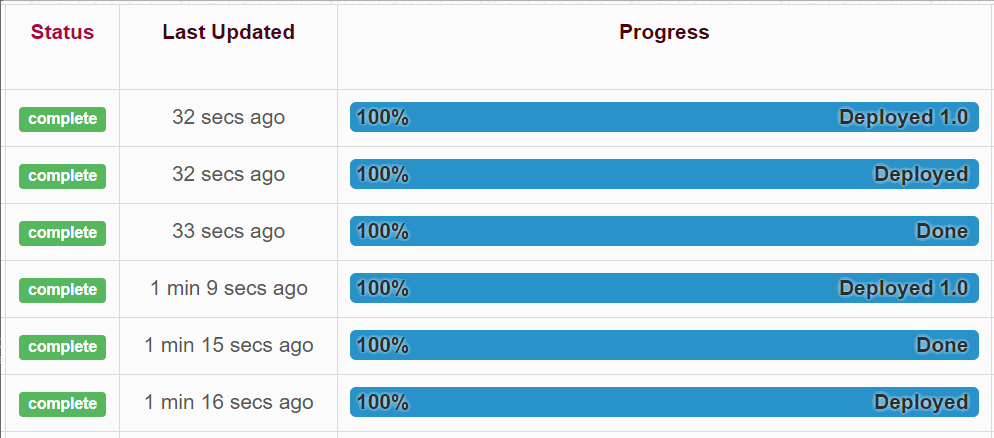

# What is Jobly

Jobly is a sidekiq-based job server with a command line interface, web API
and a web dashboard dashboard.

## What's in the Box

* **Command line interface** - for starting the server, starting the worker, and for running jobs.
* **Web API** - for executing jobs.
* **Web Dashboard** - including job progress and status.
